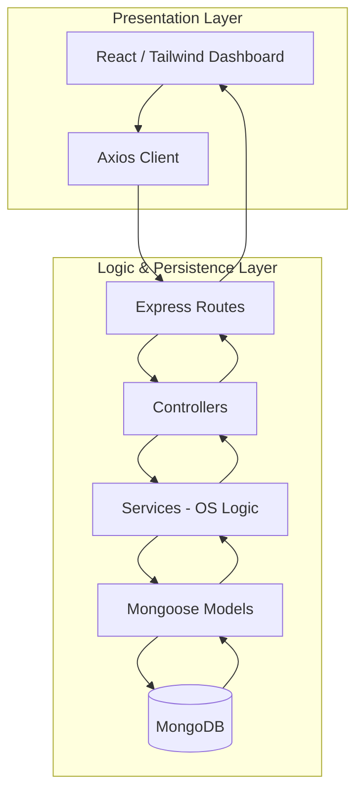
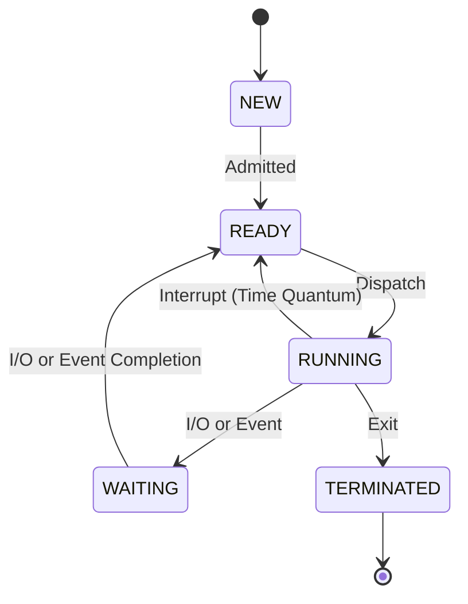
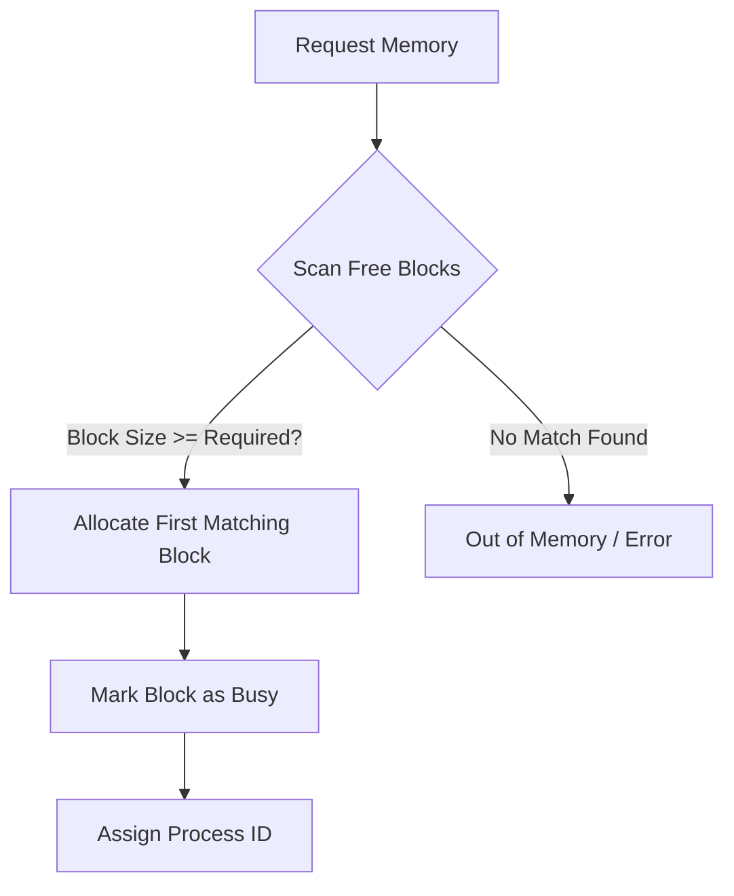

# 💻 Full-Stack Mini OS Simulator

[](https://nodejs.org/)
[](https://reactjs.org/)
[](https://www.mongodb.com/)
[](https://expressjs.com/)
[](https://tailwindcss.com/)

A high-fidelity system design project that visually simulates core Operating System concepts. This project moves beyond standard CRUD apps by implementing complex logic for **Process Scheduling**, **Contiguous Memory Management**, and a **Virtual File System (VFS)**.

---

## 🏛️ System Architecture

The simulator follows a strict **Controller-Service-Model** architecture to ensure logic (algorithms) is decoupled from data persistence and delivery layers.



---

## 🧵 Process Management & CPU Scheduling

Simulates the lifecycle of a process from creation to termination using industry-standard scheduling algorithms.

### 🔄 Process State Machine


### 🧠 Implemented Algorithms
- **First-Come-First-Serve (FCFS)**: Simple non-preemptive scheduling based on arrival time.
- **Round Robin (RR)**: Preemptive scheduling with a configurable Time Quantum, ensuring fair CPU distribution.
- **Priority Scheduling**: Executes processes based on assigned priority (Lower number = Higher density).

---

## 💾 Memory Management (RAM Simulation)

Implements **First-Fit Contiguous Allocation** logic to manage blocks of RAM dynamically.

### 🛠️ Allocation Logic


- **Persistence**: Memory state is persisted in MongoDB, allowing for "real-time" visualization across client refreshes.
- **Simulated Delays**: Execution cycles are throttled to visually demonstrate memory being held and released.

---

## 📂 Virtual File System (VFS)

A hierarchical tree model representing nested directories and files, similar to Linux/macOS file structures.

### 🌳 Tree Hierarchy
```mermaid
graph LR
    Root[/] --> Bin[bin]
    Root --> Users[users]
    Users --> Devesh[devesh]
    Devesh --> Notes(notes.txt)
    Devesh --> Projects(projects)
```

- **Recursive Logic**: Directory sizes are calculated dynamically by traversing the entire nested structure.
- **Capacity Enforcement**: Simulates a hard disk limit (64KB default) ensuring students understand storage constraints.

---

## 🛠️ Tech Stack & Tooling

| Layer | Technologies |
| :--- | :--- |
| **Frontend** | React 18, Vite, TailwindCSS, Lucide Icons, Framer Motion |
| **Backend** | Node.js, Express.js |
| **Database** | MongoDB, Mongoose ORM |
| **Simulation** | Custom Services for Scheduling, Memory & VFS |

---

## 🚀 Quick Start

### 1. Prerequisites
- [Node.js](https://nodejs.org/) (v16+)
- [MongoDB](https://www.mongodb.com/try/download/community) (Local or Atlas)

### 2. Installation
```bash
# Clone the repo
git clone https://github.com/yourusername/os-simulator.git
cd os-simulator

# Setup Backend
cd backend
npm install
# Configure .env (PORT, MONGODB_URI)
npm run dev

# Setup Frontend
cd ../frontend
npm install
npm run dev
```

---

## 📂 Deep Dive Documentation
Check the `/docs` folder for comprehensive system-design materials:
- [System Architecture](./docs/02_System_Architecture.md) - Deep dive into patterns.
- [Algorithm Deep-Dive](./docs/04_Algorithms_Deep_Dive.md) - Mathematical walkthroughs.
- [Database Design](./docs/05_Database_Design.md) - Relationships and Schemas.
- [Interview Preparation](./docs/08_Interview_Preparation_Guide.md) - How to explain this project to recruiters.

---

## 📄 License
Distributed under the MIT License. See `LICENSE` for more information.
