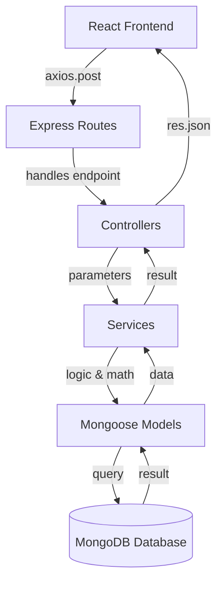

# 📄 02: System Architecture

## 🏛️ Overall Architecture: Controller-Service-Model

This project follows a clean, decoupled **layered architecture**. This separation ensures that logic (algorithms) is isolated from infrastructure (database) and delivery (API).

---

## 🧱 The Layers Explained

### 1. Delivery Layer (Frontend)
- **Role**: Capture user input and visualize state.
- **Key Components**: `Dashboard.jsx`, `Layout.jsx`, `StatsCards.jsx`.
- **API Client**: `services/api.js` centralizes all HTTP requests using Axios.

### 2. Routing Layer (Backend - Routes)
- **Role**: The entry point for all requests.
- **Files**: `src/routes/index.js`.
- **Purpose**: Map URLs like `/api/v1/scheduler/run` to specific functions in the Controllers.

### 3. Orchestration Layer (Backend - Controllers)
- **Role**: Extract data from requests (`req.body`, `req.params`) and handle HTTP responses (`res.json`).
- **Files**: `processController.js`, `fsController.js`, `logController.js`.
- **Goal**: Keep controllers thin; their only job is to communicate with the Service layer.

### 4. Logic Layer (Backend - Services)
- **Role**: **The "Heart" of the OS.** This is where the actual OS algorithms (Round Robin, First-Fit) live.
- **Files**: `SchedulerService.js`, `MemoryService.js`, `FileSystemService.js`.
- **Logic**: These services calculate time slices, find memory holes, and traverse file trees.

### 5. Data Layer (Backend - Models)
- **Role**: Define the structure of data and enforce rules (Schemas).
- **Files**: `Process.js`, `MemoryBlock.js`, `FileNode.js`.
- **Database**: MongoDB serves as the persistent memory for the simulator.

---

## 📡 Request Flow Example: Creating a Process

1. **Frontend**: User enters "Browser" (Burst 10, Mem 4096) and clicks "Add".
2. **API**: `createProcess` function in `api.js` sends a POST request to `/api/v1/process`.
3. **Route**: `router.post('/process', ...)` directs this to `processController.createProcess`.
4. **Controller**: Extracts name, burst, and memory from `req.body` and calls `processService.createProcess(...)`.
5. **Service**: Generates a PID (e.g., `P102`), creates a new `Process` document, and logs the "INFO" event.
6. **Model**: Validates the schema and saves to MongoDB.
7. **Response**: The Controller sends the new process back as JSON; the Frontend polls the list and re-renders the table.
