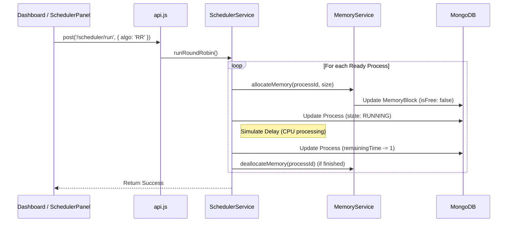

# 📄 03: Feature Flow Guide

This document explains the internal step-by-step logic of major system actions.

---

## ⚡ 1. Executing the CPU Scheduler

When a user clicks **"Execute Scheduler"** (e.g., Round Robin):

1. **Frontend**: Calls the `run` API with the chosen algorithm (RR, FCFS, or Priority).
2. **Backend**: Accesses the `SchedulerService`.
3. **Allocation**: Before execution, the scheduler calls `MemoryService.allocateMemory`. If a "First-Fit" block is found, it is reserved.
4. **Processing**: The CPU performs a mock execution (asynchronous delay).
5. **State Transition**: Process moves from `READY` -> `RUNNING`.
6. **Context Switch**: If using RR, the process moves back to `READY` after its Time Quantum, and the next process is loaded.
7. **Cleanup**: Once `remainingTime` reaches 0, the state becomes `TERMINATED` and memory is freed.

---

## 📂 2. Virtual File System (VFS) Operations

### Creating a File/Folder
1. **Frontend**: Captures `name`, `type`, and `content`.
2. **Backend**: `FileSystemService.createItem` calculates the byte length of the content.
3. **Constraint Check**: Compares `CurrentDiskUsage + NewFileSize` against `DISK_CAPACITY` (64KB).
4. **Persistence**: Saves a new `FileNode` in DB with the current `parentId`.

### Loading a File into RAM (Buffering)
1. **User Action**: Double-click a file in the explorer.
2. **API**: Calls `POST /fs/open/:id`.
3. **Backend**: `fsController` asks `MemoryService.allocateBuffer`.
4. **RAM Validation**: Checks if there is a single **contiguous block** currently free that is large enough for the file size.
5. **Success**: Block `ownerName` changes to `"Buffer: fileName"`. File content is returned to UI.
6. **Closure**: Closing the modal calls `POST /fs/close/:id`, releasing the RAM block.

---

## 🔍 3. Real-time Monitoring (Polling)

The Dashboard doesn't wait for a "Done" signal to update. It uses a **Polling Mechanism**:
1. Every 3 seconds, `Dashboard.jsx` executes a `loadData()` call.
2. It fetches all processes, memory blocks, logs, and storage stats simultaneously.
3. This is why you see memory blocks turning red/green and process bars moving in real-time while the simulation is still conceptually "running" on the backend.
